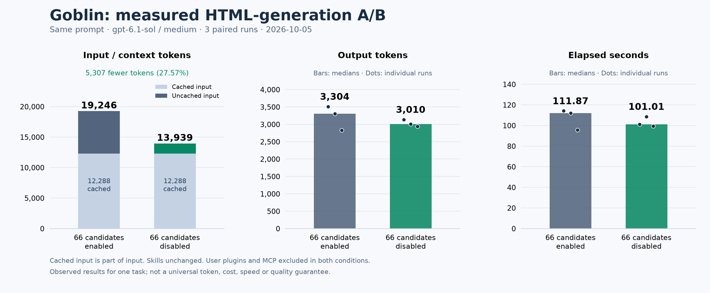

<p align="center">
  
</p>

# Goblin

**Your little skill keeper.** A local AI skill manager for CLI, Codex and Claude Desktop. Version **0.0.1** is a first macOS release candidate; no hosted service or LLM API key is required.

## Install

Requires Node.js 22 or newer and Git. Install with one command:

```sh
npm install --global github:0attaphon/goblin
```

Then scan your installed skills:

```sh
goblin scan
```

The repository includes a ready-to-run CLI. You do not need to clone the repository or run the build yourself. Use the same install command to update; uninstall with `npm uninstall --global goblin-skill-manager`.

## Measured results



[Download vector chart (SVG)](benchmarks/html-context/comparison.svg). Bars show medians; dots show individual output/time measurements. The input chart separates cached and uncached tokens.

**5,307 fewer input tokens (27.57%)** in a real HTML-generation experiment on 2026-10-05. Six Codex CLI calls used the same Thai dashboard prompt and model (`gpt-6.1-sol`, medium reasoning), arranged as three pairs with alternating order. The baseline enabled 66 local skill candidates; the focused condition disabled those 66 candidates for the invocation because this self-contained task needed no optional skill.

| Metric | 66 candidates enabled | 66 candidates disabled |
| --- | ---: | ---: |
| Input tokens, median | 19,246 | 13,939 |
| Cached input tokens, median | 12,288 | 12,288 |
| Uncached input tokens, median | 6,958 | 1,651 |
| Output tokens, median | 3,304 | 3,010 |
| Elapsed seconds, median | 111.87 | 101.01 |

Input was 19,246 versus 13,939 in **every pair**, measured from Codex's actual usage events. Cached input is part of input, not an extra count. Installed skill files stayed unchanged; all six runs produced HTML. Basic document, inline CSS/JS, control labels and external-asset checks passed on all six outputs; browser search and status-filter checks covered the first pair.

These numbers measure prompt/context tokens for one single-response task, not context-window capacity. Both conditions excluded user plugins and MCP, including Goblin's own MCP overhead. Output length, latency, caching and quality can vary; this is **not a universal token, cost or quality guarantee**.

Evidence: [full A/B report](benchmarks/html-context/report.md), [measurements](benchmarks/html-context/results.json), [exact prompt](benchmarks/html-context/prompt.txt), [HTML checks](benchmarks/html-context/quality-checks.json), [baseline HTML](benchmarks/html-context/runs/pair-1-all/index.html), [focused HTML](benchmarks/html-context/runs/pair-1-focused/index.html).

**Automated verification: 37/37 tests pass.** This includes 10 real terminal/PTY scenarios for multi-selection, cancellation, scrolling, stale selections, shared aliases and interrupted-write recovery. The remaining tests cover catalog safety, reversible changes, CLI and MCP. Tests use temporary fixture roots and never modify the user's installed skills. Python 3 is needed only to run the PTY tests; using Goblin requires Node.js and Git as described above.

## Develop locally

```sh
cd goblin
npm ci --ignore-scripts
npm run compile
node dist/cli.js scan
```

To install the command from the local project:

```sh
npm install --global .
goblin --version
goblin scan
```

To prepare a distributable tarball without publishing:

```sh
npm run pack:release
npm install --global ./goblin-skill-manager-0.0.1.tgz
```

The npm package name has not been reserved. No package has been published.

## Select and disable in the terminal

Run `goblin scan` in a terminal to open the checkbox list:

```text
Goblin — Select skills to disable in Codex

> [ ] caveman (enabled)
  [x] firecrawl (enabled)
  [x] pdf (enabled)
  [–] system-skill (enabled) — managed / system / synced

↑↓ Move · Space Check · Enter Submit · Esc Cancel
```

Use **↑/↓** to move and **Space** to check multiple skills. **Enter** submits once and disables the checked skills in sequence. **Esc** or **Ctrl+C** cancels without changing files. Nothing is selected initially; Enter with no selections makes no changes. The focused row shows its ID, path, source and usage information; long text is clipped to the terminal width, and the list scrolls as you move.

Only supported manual **Codex** skills can be checked. Already disabled, managed, synced, system and other-provider entries display why they cannot be selected. Skill files stay in place; this changes native Codex configuration. Restart Codex afterward. No instructions, hooks, tools or token overhead are added to other skills.

Goblin checks every selection before writing. A changed skill or an unsupported config stops submission. Changes are applied sequentially, rather than as an atomic transaction; a failure stops remaining changes and reports any completed ones. The summary prints restore commands **in reverse order** because every edit shares the same config file. Run those commands in the printed order to undo the selection; later independent config edits can cause a restore conflict.

`goblin scan --no-interactive` shows the original table. `--json` and piped/non-terminal output stay read-only and never open checkboxes. The MCP interface also stays read-only when scanning.

## Commands

```sh
goblin scan
goblin scan --no-interactive
goblin scan --json
goblin scan --project /absolute/path/to/project
goblin scan --root /absolute/path/to/skills
goblin inspect <name-or-id>
goblin tidy
goblin remove <name-or-id> --dry-run
goblin remove <name-or-id>
goblin restore <change-id> --dry-run
goblin restore <change-id>
goblin disable <name-or-id> --app codex
goblin enable <name-or-id> --app codex
goblin history
```

`scan` immediately shows **ID, name, absolute path, last use, use count, state and source**. `--json` includes canonical paths, shared-link information and scan issues. There is no separate `least-used` command.

**เวลาการเรียกใช้:** รุ่นนี้ยังไม่มีตัวอ่านหลักฐานการใช้สกิลจริง จึงแสดง `unknown` ในตาราง และ `null` ใน JSON ไม่ใช้เวลาแก้ไขไฟล์หรือเวลาสแกนแทน และไม่ตีความว่าไม่เคยใช้

`remove` / `stash` removes a manually installed skill from discovery and retains its original files in a recovery archive. It does **not** permanently delete files. A change ID is printed so that the exact change can be restored. An ambiguous name requires choosing an ID from `scan`.

If the same physical skill is referenced by several discovered paths, removal affects that group of references across the configured roots. Preview with `--dry-run` to see those paths. Exact copies are separate skills; Goblin does not delete duplicates automatically. References outside configured roots cannot be enumerated or managed.

Plugin caches, bundled/system skills, synced sources and nested directory aliases are read-only. Plugin cache entries have unknown activation status; a cached version is not proof that the host loads it. Native `disable` / `enable` currently supports manually installed Codex skills only. It edits the selected `[[skills.config]]` entry while preserving other config text. Symlinked config files, multiline TOML strings, unsupported or invalid TOML formats are refused. Restart Codex after changing its skill configuration.

## Roots and state

Default discovery roots:

- `~/.agents/skills` — Codex/shared user skills
- `~/.claude/skills` — local Claude Code skills
- `~/.codex/skills` — legacy Codex skills, including read-only `.system`
- `~/.codex/plugins/cache` and `~/.claude/plugins/cache` — read-only plugin skills

`--root` replaces the defaults and is repeatable. `--project` adds the specified project's `.agents/skills` and `.claude/skills`; parent repository roots are not automatically searched in this release.

On macOS, plans, journals and archives live in `~/Library/Application Support/Goblin`. Elsewhere they default to `~/.local/share/goblin`. Override with `--data-dir` or `GOBLIN_DATA_DIR`. State must be separate from every discovery root. Keep using the same roots and state directory when applying or restoring a change.

Scan limits: 20,000 visited entries, depth 10; per-skill fingerprint limits: 10,000 files, depth 32, 64 MiB total file bytes. Oversized or unreadable skills remain read-only. Skill scripts are never executed.

## Connect Codex and Claude Desktop

Print connection settings using the executable path on your machine:

```sh
goblin setup codex --print
goblin setup claude-desktop --print
```

For Codex, add the printed `[mcp_servers.goblin]` table to your MCP configuration. For Claude Desktop, merge the printed `goblin` entry into `mcpServers` in `~/Library/Application Support/Claude/claude_desktop_config.json`, preserving other entries. Restart the client after adding the connection.

`setup` only prints settings. It does not change your client configuration or install a skill. Absolute Node.js and script paths avoid differences between the terminal and desktop application's PATH.

You can request “scan my skills” or “remove skill ID sk_…” in the connected client. MCP exposes seven fixed tools: `goblin_scan`, `goblin_inspect`, `goblin_tidy`, `goblin_plan`, `goblin_apply`, `goblin_restore`, `goblin_history`. Changes use a plan ID before applying. `goblin_plan` can page affected entries using `plan_id` and `cursor`.

Claude Desktop is a control surface for **local files** here. Skills uploaded to Claude's cloud account are outside this version's scope. The MCP server is verified against an SDK client; connections in the actual Codex and Claude Desktop UIs still require a host smoke test.

## Context/token contract

- Goblin never edits skill instructions or adds wrappers, hooks, project instructions or dependencies to another skill.
- Scanning, hashing, grouping and auditing happen locally, without LLM calls.
- Indexes/history/archive are outside skill discovery roots, so they do not create new skills for AI to load.
- MCP tool definitions are fixed, not generated per skill. No skill bodies are returned.
- MCP metadata responses are paginated, at most 20 items per page by default, with an 8 KiB serialized tool-result ceiling. Cursors are invalidated when the corresponding dataset changes.
- Direct terminal use requires no model context. Calling through an AI host has Goblin's own tool-definition/result overhead; **zero total token overhead is not claimed**.

## Recovery

Goblin journals a change before moving files, verifies stale plans and uses an exclusive state-directory lock. Restore refuses modified archive contents and will never intentionally overwrite a new skill at the original path. Interrupted changes block new mutations until recovered.

```sh
goblin history
goblin restore <interrupted-change-id> --dry-run
goblin restore <interrupted-change-id>
```

If a process crashes while holding the lock, confirm no Goblin process is running, inspect `lock/owner.json` in the state directory, then remove **only that stale lock directory** and use `history` / `restore`. Never delete the archive/journal to resolve a lock. Do not run a plugin/sync installer concurrently with Goblin.

Cross-filesystem moves use a verified staging copy. If an interruption leaves a `.copy` staging artifact, preserve it while checking history; restore uses the original/committed archive and leaves incomplete staging data for inspection. If deletion of the original was interrupted and leaves a partial source, restore refuses that conflict. Preserve the partial source by moving it to a separate location outside discovery roots, then run restore again; compare the preserved files before discarding anything. Archives may retain files containing secrets: keep the state directory private and do not publish it. Unrelated edits to config after a change cause restore to refuse replacing that config; resolve that conflict manually.

## Development

See [Measured results](#measured-results) for benchmark evidence and automated verification coverage.

```sh
npm test
npm run check
npm run pack:release
```

Tests use temporary fixture roots, including real filesystem symlinks and MCP SDK client/server processes. They never remove the user's installed skills. Actual account usage data, cloud skills, profiles and permanent deletion are outside 0.0.1.

Protocol and host references: [MCP server guide](https://modelcontextprotocol.io/docs/develop/build-server), [Codex MCP](https://developers.openai.com/codex/mcp/), [Codex skill configuration](https://developers.openai.com/codex/skills/).
